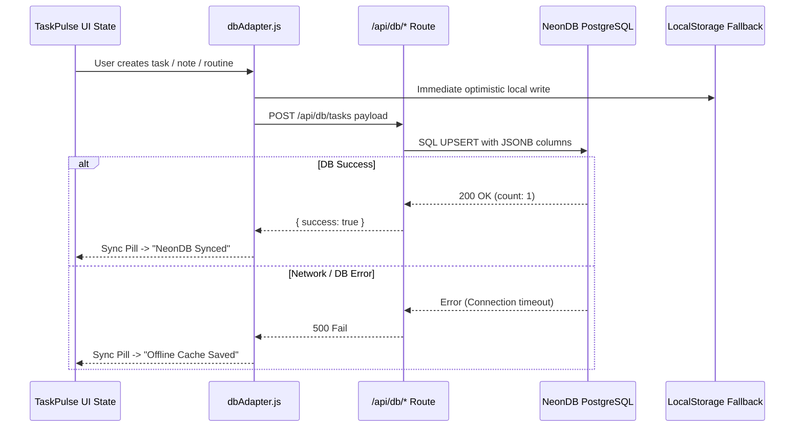
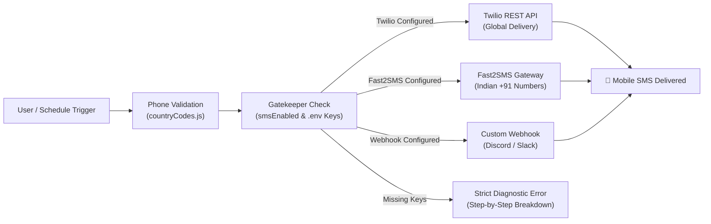

# 🛠️ TaskPulse Comprehensive Tech Stack & Architecture Compendium

This document serves as the architectural reference for all technologies, infrastructure layers, third-party services, and automation frameworks utilized in the **TaskPulse** ecosystem.

---

## 🏛️ 1. Master System Architecture Diagram

```mermaid
graph TD
    subgraph Client_Layer ["🖥️ Client Application Layer (Next.js 14 App Router)"]
        UI["Modern Dark Glassmorphism UI\n(Tailwind CSS + Custom Variables)"]
        TM["Microsoft To-Do Engine\n(TaskManager.js)"]
        KN["Google Keep Notes Vault\n(NoteCanvas.js)"]
        RM["Apple Reminders & Routines\n(RoutineManager.js)"]
        SU["OSS Sharing & Productivity\n(ShareRedirectModal.js)"]
        NM["Automated Dispatches\n(NotificationManagerModal.js)"]
    end

    subgraph State_And_Adapters ["🔄 State Management & Offline Fallback"]
        DA["src/lib/dbAdapter.js\n(Multi-Provider Routing)"]
        LS["Browser LocalStorage\n(Indexed offline state)"]
        VAL["src/lib/countryCodes.js\n(Real-time SMS Validator)"]
    end

    subgraph Backend_APIs ["⚡ Next.js Serverless Route Handlers (/api)"]
        API_Tasks["/api/db/tasks\n(PostgreSQL CRUD + JSONB)"]
        API_Notes["/api/db/notes\n(PostgreSQL CRUD + JSONB)"]
        API_Profiles["/api/db/profiles\n(Multi-User RBAC & Locks)"]
        API_Routines["/api/db/routines\n(Habit streaks & recurring)"]
        API_Email["/api/notifications/email\n(Nodemailer SMTP Relay)"]
        API_SMS["/api/notifications/sms\n(Multi-Carrier Gateway Router)"]
    end

    subgraph External_Cloud ["☁️ Cloud Infrastructure & Third-Party APIs"]
        NEON["NeonDB PostgreSQL\n(Serverless Pooler)"]
        SUPA["Supabase PostgreSQL\n(Optional Secondary DB)"]
        GMAIL["Gmail SMTP Server\n(smtp.gmail.com:587)"]
        FAST2SMS["Fast2SMS Carrier\n(Indian Mobile Routes)"]
        TWILIO["Twilio REST API\n(Global Programmable SMS)"]
        VERCEL["Vercel Edge Cloud\n(Global CDN & SSR)"]
    end

    subgraph OSS_Ecosystem ["🌐 Open-Source Productivity Suite"]
        CS["Codeshare.io\n(Live Collaborative Code)"]
        TS["Toffeeshare\n(P2P Encrypted File Transfer)"]
        EXC["Excalidraw\n(Virtual Collaborative Whiteboard)"]
        CRY["CryptPad\n(Zero-Knowledge Private Docs)"]
        CYB["CyberChef\n(The Cyber Swiss Army Knife)"]
        DRW["Draw.io\n(Flowcharts & Architecture Diagrams)"]
    end

    UI --> TM & KN & RM & SU & NM
    TM & KN & RM --> DA
    NM --> VAL
    DA --> LS
    DA --> API_Tasks & API_Notes & API_Profiles & API_Routines
    NM --> API_Email & API_SMS
    SU --> CS & TS & EXC & CRY & CYB & DRW

    API_Tasks & API_Notes & API_Profiles & API_Routines --> NEON
    API_Tasks & API_Notes & API_Profiles & API_Routines -.-> SUPA
    API_Email --> GMAIL
    API_SMS --> FAST2SMS & TWILIO
    Client_Layer -.-> VERCEL
```

---

## 📊 2. Categorized Tech Stack Deep-Dive

### Category 1: Frontend Framework & Core Web Engine

| Specification | Current Implementation |
| :--- | :--- |
| **Technology** | **Next.js 14 (App Router) + React 18 / 19** |
| **Why Selected** | Hybrid static-site generation (SSG) with on-demand dynamic API route handlers in a single repository. Zero-config compilation, fast bundling, and built-in edge optimizations. |
| **Pros** | • Native App Router with nested layouts. • Server & Client component segregation. • Seamless Vercel serverless deployment. • Excellent SEO and instant First Load JS (~87 kB shared). |
| **Cons** | • Webpack cache collisions when building while dev server is active. • Steeper learning curve around client vs. server component boundary (`use client`). |
| **When to Use** | When building full-stack web applications requiring modern React interfaces, fast SSR/SSG rendering, and serverless backend API endpoints. |

#### 🔄 Industry Alternatives & Comparison:
- **Vite + React SPA**:
  - *Pros*: Extremely lightweight, fast Hot Module Replacement (HMR).
  - *Cons*: Requires separate Express/NestJS backend server; no native serverless API routes.
  - *When to use*: Pure client-side single-page applications or embedded widgets with external APIs.
- **SvelteKit / Svelte 5**:
  - *Pros*: Zero virtual DOM overhead, smaller bundle sizes.
  - *Cons*: Smaller component ecosystem and third-party library support compared to React.
  - *When to use*: High-performance web apps demanding ultra-low bandwidth consumption.
- **Remix / React Router 7**:
  - *Pros*: Exceptional nested routing and web standard form action handlers.
  - *Cons*: Smaller deployment ecosystem compared to Next.js + Vercel.
  - *When to use*: Heavy form-based CRUD applications with intensive data mutations.

---

### Category 2: Styling, Design System & Iconography

| Specification | Current Implementation |
| :--- | :--- |
| **Technology** | **Tailwind CSS + Custom CSS Variables + Lucide React** |
| **Why Selected** | Utility-first styling with dark-mode primary aesthetic, glassmorphism backdrops (`backdrop-blur-md`), vibrant gradients, and lightweight SVG icons. |
| **Pros** | • Zero runtime CSS overhead (purged utility classes). • Fully customizable HSL design tokens. • Over 1,000+ vector icons from `lucide-react`. • Consistent responsive breakpoints (`sm`, `md`, `lg`, `xl`). |
| **Cons** | • Long class names in JSX elements without component extraction. • Requires Tailwind build step. |
| **When to Use** | Modern interactive dashboards demanding high-fidelity aesthetics, bespoke theme palettes, and fast design iteration. |

#### 🔄 Industry Alternatives & Comparison:
- **Shadcn UI + Radix Primitives**:
  - *Pros*: Accessible, pre-built headless accessible components.
  - *Cons*: Adds additional component dependencies into workspace.
  - *When to use*: Large enterprise apps needing strict WCAG accessibility compliance.
- **Vanilla CSS Modules**:
  - *Pros*: Zero external dependencies, pure standard CSS.
  - *Cons*: Slower developer iteration speed for responsive grids and complex hover states.
  - *When to use*: Lightweight micro-frontends with minimal styling requirements.

---

### Category 3: Serverless Database & Persistence Layer

| Specification | Current Implementation |
| :--- | :--- |
| **Technology** | **NeonDB PostgreSQL (`@neondatabase/serverless`)** |
| **Why Selected** | Fully managed serverless PostgreSQL 16 with instant auto-scaling, connection pooling over WebSocket/HTTP, and native JSONB schema support. |
| **Pros** | • Zero idle cost and scale-to-zero compute. • Handles serverless connection spikes without connection exhaustion. • Native PostgreSQL ACID compliance. • Structured JSONB array support for subtasks, tags, and media. |
| **Cons** | • Cold start latency (~300-500ms) on dormant branches. • Requires internet access (handled via LocalStorage fallback). |
| **When to Use** | Cloud-native applications with variable traffic patterns requiring enterprise relational integrity and JSON flexibility. |

#### 🔄 Industry Alternatives & Comparison:
- **Supabase (PostgreSQL + Realtime)**:
  - *Pros*: Built-in auth, realtime websocket subscriptions, row-level security (RLS).
  - *Cons*: Pauses free tier databases after 7 days of inactivity.
  - *When to use*: Apps needing built-in OAuth login and live multi-client broadcast feeds.
- **PlanetScale (Serverless MySQL)**:
  - *Pros*: Unlimited horizontal scale, schema branching.
  - *Cons*: Discontinued free tier; lacks foreign key constraints in standard mode.
  - *When to use*: High-throughput distributed write workloads.
- **SQLite / Turso (libSQL)**:
  - *Pros*: Ultra-fast edge replicas, embedded database capability.
  - *Cons*: Less feature-rich JSON querying compared to PostgreSQL JSONB.
  - *When to use*: Edge workers and local-first desktop/mobile applications.

---

### Category 4: Email Notification & Automated Digest Engine

| Specification | Current Implementation |
| :--- | :--- |
| **Technology** | **Nodemailer SMTP (Gmail TLS Relay on Port 587)** |
| **Why Selected** | Open-source, battle-tested Node.js email transport with zero proprietary vendor lock-in. Sends formatted dark HTML emails with daily proverbs and tabular task breakdowns. |
| **Pros** | • Works with any SMTP provider (Gmail, Outlook, Postmark, custom relays). • Zero external API subscription costs for personal scale (500 free emails/day via Gmail). • Full custom HTML/CSS template control. |
| **Cons** | • Requires Google App Passwords for Gmail 2FA accounts. • Slower than HTTP REST APIs (~1-2 seconds per TLS handshake). |
| **When to Use** | Daily morning digests, task reminder schedules, and automated operational reports. |

#### 🔄 Industry Alternatives & Comparison:
- **Resend (Modern Email API for Developers)**:
  - *Pros*: Ultra-fast HTTP API, React Email component integration, live analytics.
  - *Cons*: Free tier limited to 100 emails/day and 1 verified domain.
  - *When to use*: Commercial SaaS applications needing high-deliverability transactional emails.
- **Amazon SES (Simple Email Service)**:
  - *Pros*: Lowest cost at scale ($0.10 per 1,000 emails), high deliverability.
  - *Cons*: Complex AWS IAM setup and initial sandbox restrictions.
  - *When to use*: Large-scale consumer mailing lists and high-volume background notifications.

---

### Category 5: Mobile SMS & Carrier Messaging Engine

| Specification | Current Implementation |
| :--- | :--- |
| **Technology** | **Fast2SMS API + Twilio REST API + International Phone Validator** |
| **Why Selected** | Multi-carrier architecture supporting low-cost Indian mobile SMS routes (Fast2SMS) and global programmable delivery (Twilio) with strict step-by-step diagnostic verification. |
| **Pros** | • Dedicated Indian routes with fast OTP/Quick routes. • Twilio global reach across 180+ countries. • Real-time format validation across 30+ international calling codes. • Zero false-positive dispatch claims. |
| **Cons** | • Fast2SMS requires minimum ₹100 recharge for Dev API route activation. • Twilio requires trial verification for unverified recipient numbers. |
| **When to Use** | Urgent task reminders, scheduled due-date SMS digests, and time-critical priority alerts. |

#### 🔄 Industry Alternatives & Comparison:
- **Telegram Bot Webhook API**:
  - *Pros*: **100% Free Forever**, supports rich media, instant push notifications on mobile/desktop.
  - *Cons*: Recipient must install Telegram and start the bot.
  - *When to use*: Personal productivity systems where free push alerts are preferred over carrier SMS charges.
- **Firebase Cloud Messaging (FCM) / Web Push**:
  - *Pros*: 100% free native browser and mobile operating system push banners.
  - *Cons*: Requires active browser service workers and device notification permissions.
  - *When to use*: In-browser and PWA notifications without phone number requirements.

---

### Category 6: Open-Source Productivity & Real-Time Collaboration Suite

| Tool | Integrated Route / Embed | Core Capability & Value |
| :--- | :--- | :--- |
| **Codeshare.io** | `https://codeshare.io/[room-code]` | Instant real-time collaborative code editor with live syntax highlighting and zero account requirements. |
| **Toffeeshare** | `https://toffeeshare.com` | Unlimited end-to-end encrypted peer-to-peer file sharing directly between browsers without storing files on any cloud server. |
| **Excalidraw** | Direct Launchpad | Collaborative virtual whiteboard for sketch-style architecture diagrams, mind maps, and wireframing. |
| **CryptPad** | Direct Launchpad | Zero-knowledge encrypted collaborative suite (Rich text docs, spreadsheets, Kanban boards, code snippets). |
| **CyberChef** | Direct Launchpad | The "Cyber Swiss Army Knife" by GCHQ for encoding/decoding (Base64, Hex, URL, Hash, JWT, RegEx analysis). |
| **Draw.io** | Direct Launchpad | Industry-standard diagramming suite for UML, AWS/GCP cloud architectures, BPMN flows, and entity-relationship models. |

---

### Category 7: Hosting, Edge CDN & Infrastructure

| Specification | Current Implementation |
| :--- | :--- |
| **Platform** | **Vercel Serverless Hosting + GitHub CI/CD** |
| **Production URL** | [https://taskpulse17.vercel.app](https://taskpulse17.vercel.app) |
| **Repository** | [https://github.com/tiwari17aditya/taskpulse.git](https://github.com/tiwari17aditya/taskpulse.git) |
| **Pros** | • Automated preview and production builds on `git push origin main`. • Edge routing and global CDN caching. • Automated environment synchronization via `/manage-vercel`. |
| **Cons** | • 10-second serverless function timeout on Hobby free tier. • Bandwidth limits on massive media traffic. |
| **When to Use** | Modern Next.js full-stack deployments demanding zero DevOps maintenance. |

#### 🔄 Industry Alternatives & Comparison:
- **Cloudflare Pages + Workers**:
  - *Pros*: Ultra-fast edge execution (0ms cold start), generous free tier.
  - *Cons*: Node.js runtime compatibility differences for native modules.
  - *When to use*: High-throughput edge APIs and global static sites.
- **Docker + Railway / Render**:
  - *Pros*: Full Linux container environment; supports long-running daemons and persistent cron jobs.
  - *Cons*: Slower cold starts on free/hobby tiers; manual scaling configuration.
  - *When to use*: Complex backend services needing background workers, Redis, and full Docker setups.

---

### Category 8: Agentic AI Engineering & Workspace Automation

| Component | Location | Role in TaskPulse |
| :--- | :--- | :--- |
| **Custom Skills** | [`.agents/skills/`](file:///d:/Antigravity-Projects/taskpulse/.agents/skills) | Domain cheatsheets and specialized workflows (`manage-vercel`, `test-db`, `test-email`, `check-data-flow`, `sync-docs`). |
| **Slash Commands** | [`.agents/commands/`](file:///d:/Antigravity-Projects/taskpulse/.agents/commands) | 18 modular interactive shortcuts for rapid testing, auditing, and maintenance. |
| **Operational Trackers** | [`audits/`](file:///d:/Antigravity-Projects/taskpulse/audits) | Tabular token usage accounting (`token_usage.md`), release changelog (`VERSION.md`), and daily logs (`logs/`). |
| **Workspace Rules** | [`AGENTS.md`](file:///d:/Antigravity-Projects/taskpulse/.agents/AGENTS.md) | Enforces context optimization, anti-hallucination policies, and continuous documentation sync. |

---

## 🎯 3. Tech Stack Decision Matrix

| Scenario / Goal | Recommended Choice in TaskPulse | Alternative if Requirements Shift |
| :--- | :--- | :--- |
| **Standard Task & Note Persistence** | **NeonDB PostgreSQL** (Active) | **Supabase** (If real-time multi-user live cursors are needed) |
| **Offline / Travel Mode** | **Browser LocalStorage** (Active Fallback) | **IndexedDB / Dexie.js** (For 50MB+ offline media caching) |
| **Daily Morning Digest** | **Nodemailer SMTP (Gmail)** (Active) | **Resend / React Email** (If branded marketing templates are needed) |
| **Urgent Due-Date Mobile Alerts** | **Fast2SMS / Twilio** (Active) | **Telegram Bot Webhook** (If 100% free unlimited push is required) |
| **Collaborative Code Editing** | **Codeshare.io** (Active) | **Live Share / Monaco Editor** (If self-hosted in-app code editor is required) |
| **Large File Sharing** | **Toffeeshare P2P** (Active) | **AWS S3 Presigned URLs** (If files must be stored permanently in the cloud) |
